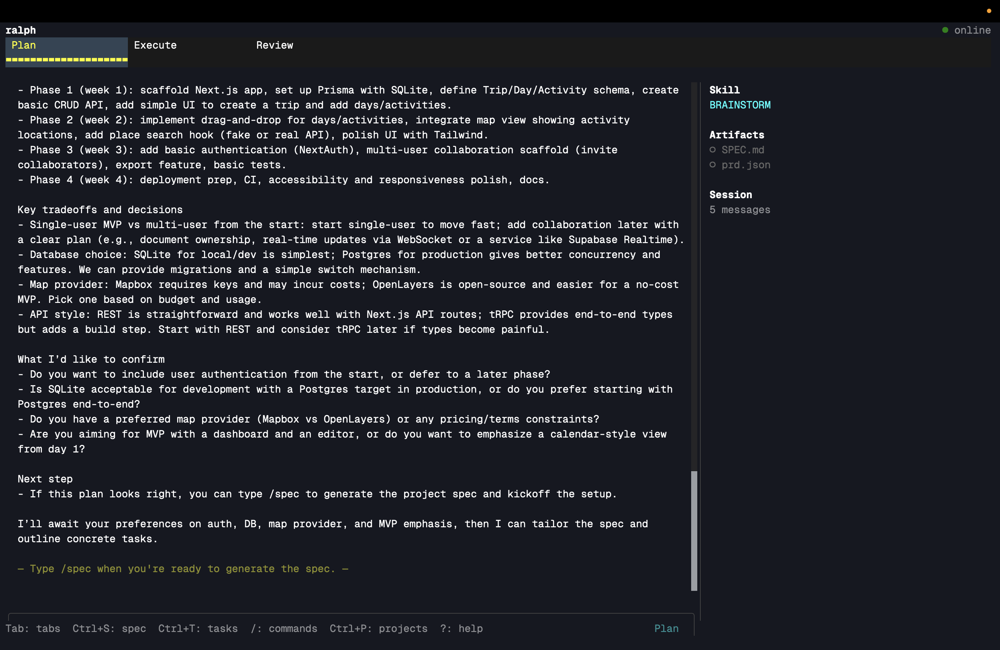

<!-- jump_to_middle -->

<!-- alignment: center -->

<!-- no_footer -->

# Live demo

- Spin up a **Ralph loop** with a pre-baked PRD
- Build a habit tracking web app

<!-- end_slide -->

# Ralph, the methodology

> [!important]
> **One task per session.** Read state from disk → execute → write state back → loop.

- <span style="color: palette:lavender">Files on disk are the contract</span>: `SPEC.md`, `prd.json`, `progress.md` are the agent's only memory between sessions
- <span style="color: palette:green">Each iteration starts fresh</span>: no carry-over context; the agent rebuilds state by reading the files

## **The loop, per iteration:**

1. **Read** `SPEC.md`, `prd.json`, `progress.md` to rebuild context
2. **Pick** one open task from `prd.json` (where `passed: false`)
3. **Implement & verify:** tests, type checks, lint
4. **Append** an entry to `progress.md`, mark the task `passed`, commit
5. **Signal** `RALPH_TASK_COMPLETE` → next iteration, fresh context

<!-- end_slide -->

# What is Ralph, the TUI

<!-- list_item_newlines: 1 -->

> [!tip]
> A **daemon-backed** TUI so agents keep working after you detach.

- <span style="color: palette:sky">Orchestration</span>: one loop across workspaces, not one-off chats
- <span style="color: palette:green">Resilience</span>: `ralphd` owns runs; the TUI is a thin client
- <span style="color: palette:yellow">Visibility</span>: single dashboard for every project in flight

<!-- end_slide -->

# Opencode problem → Ralph solution

<!-- column_layout: [1, 1] -->

<!-- column: 0 -->

> **Problem**

- In opencode, the **TUI and agent lifetime are tied together**
- Closing the UI can **kill long-running work**
- Multi-project workflows get **scattered across windows and sessions**

<!-- column: 1 -->

> **Solution**

- Ralph **decouples the TUI from the daemon**
- Agents keep running **in the background**
- One TUI gives a **single view across all active projects**

<!-- reset_layout -->

<!-- end_slide -->

# Methodology problem → Ralph solution

<!-- column_layout: [1, 1] -->

<!-- column: 0 -->

> **Problem**

- Giant sessions create **too much noise**
- Too much context can mean **worse performance and more hallucination**
- Goal-only prompting leaves agents **too much room to drift**

<!-- column: 1 -->

> **Solution**

- **One task per session:** isolated context, no bloat, fewer hallucinations
- **Pre-planned, actionable steps** in `prd.json`. Execution is instruction-following, not reasoning
- **Plan with a smart model, execute with a cheap one:** same quality, lower cost
- Workflow grounded in `PROMPT.md`, `SPEC.md`, `prd.json`, `progress.md`. **Explicit and reproducible.**

<!-- reset_layout -->

<!-- end_slide -->

# Product overview: structured agent workflow

> [!tip]
> Agentic coding needs a workflow: **define the work, manage the work, review the work**.

| <span style="color: palette:sky">Tab</span> | <span style="color: palette:text">Product job</span> |
| ------------------------------------------- | ---------------------------------------------------- |
| **Plan**                                    | Turn an idea / PRD into `SPEC.md` + `prd.json`       |
| **Execute**                                 | Convert plan files into visible task workstreams     |
| **Review**                                  | Inspect output, then accept, revise, or continue     |

- <span style="color: palette:lavender">From vague prompt → scoped tasks → reviewed changes</span>
- The human keeps control while the agent moves through scoped tasks

<!-- end_slide -->

# Tech stack

| Layer    | Choice                                         |
| -------- | ---------------------------------------------- |
| Language | **TypeScript**                                 |
| UI       | **OpenTUI:** `@opentui/core`, `@opentui/react` |
| Runtime  | **Bun**                                        |
| Monorepo | **Turborepo** (dev orchestration)              |

<!-- end_slide -->

# The daemon

> [!note]
> **`ralphd`:** a long-running daemon that is the single source of truth for all agent work.

- **Omnipotent across directories:** todo apps, trip planners, any project you've ever worked on — `ralphd` manages them all
- **Owns the agent loop:** execution continues whether or not a UI is attached
- **Persists state** in `~/.ralph/state.sqlite`, communicates over `~/.ralph/ralphd.sock`

```
  ┌─ ralphd (long-running daemon) ─────────────────────────┐
  │                                                         │
  │   ~/todo-app ──┐                                        │
  │                │                                        │
  │   ~/planner ───┼──→  agent loop  ──→  state.sqlite      │
  │                │      (per dir)                          │
  │   ~/client  ───┘                                        │
  │                                                         │
  │   ralphd.sock  ←── TUIs subscribe here                  │
  └─────────────────────────────────────────────────────────┘
```

<!-- end_slide -->

# The TUI

> [!note]
> **The TUI is purely a UI layer.** It holds no state — it subscribes to `ralphd` over a socket and renders what it's told.

- **Stateless client:** all information comes from the daemon, the TUI just displays it
- **Multiplexable:** spin up N TUIs on the same project — the daemon doesn't care
- **Disposable:** close the TUI and the agent keeps running. Reattach whenever you want

```
                ┌─── TUI (kitchen laptop) ───┐
                │    subscribe ↓              │
                └────────────────────────────-┘
                          │
  ralphd.sock ◄───────────┼────────────────────┐
       │                  │                    │
       ▼                  │                    │
  ┌─ ralphd ─┐    ┌─── TUI (desk) ───┐   ┌─── TUI (ssh) ───┐
  │ agent loop│    │   subscribe ↓    │   │   subscribe ↓    │
  │ (running) │    └──────────────────┘   └──────────────────┘
  └───────────┘
```

<!-- end_slide -->

# `.ralph/` workspace

> [!note]
> The **contract** between humans and agents lives on disk: inspectable, diffable, versioned.

| File          | Job                              |
| ------------- | -------------------------------- |
| `SPEC.md`     | What you are building            |
| `prd.json`    | Task list + pass / fail          |
| `progress.md` | Append-only iteration log        |
| `PROMPT.md`   | One-task-per-session agent rules |

```markdown +line_numbers
1. SPEC.md: what you're building
2. prd.json: task list
3. progress.md: append-only log
```

<!-- end_slide -->

# npm packaging

> [!tip]
> **`npm i -g @techatnyu/ralph`:** native binaries, no Node runtime, no postinstall scripts.

- **Pattern:** meta-package + per-platform packages via `optionalDependencies`
- **Bun compiles** `ralph` (TUI) and `ralphd` (daemon) into **single-file native binaries** that ships together per os/cpu
- **npm picks one package** from the user's `os` + `cpu`, so users only download bytes for their platform

```
  npm i -g @techatnyu/ralph
         │
         ▼
  ┌─ @techatnyu/ralph  (root meta-package) ─────────┐
  │    bin/ralph    ─ launcher (uname → exec)    │
  │    bin/ralphd   ─ launcher (uname → exec)    │
  │    optionalDependencies ↓                     │
  └───────────────┬───────────────────────────┘
                  │  npm resolves 1 of 6 by os + cpu
                  ▼
  ┌─ @techatnyu/ralph-{os}-{cpu} ─────────────┐
  │    bin/ralph    ─ compiled binary           │
  │    bin/ralphd   ─ compiled binary           │
  │    "os": [...]  "cpu": [...]                 │
  └───────────────────────────────────────────┘

  6 platforms: darwin / linux / windows  ×  x64 / arm64
```

<!-- end_slide -->

# CLI

The Ralph CLI is built on `@crustjs/core` and speaks JSON-RPC to `ralphd` over a Unix socket. It is completely stateless, every meaningful operation is available as a command with `--json` output, so the same tool works for interactive use and CI/CD pipelines.

| Command | What it does |
| ------- | ------------ |
| `ralph` | Launch the TUI (auto-connects to `ralphd`) |
| `ralph setup` | Guided first-time setup + model picker |
| `ralph doctor` | Check prerequisites (OpenCode, auth, daemon) |
| `ralph daemon start` | Start `ralphd` in the background (idempotent) |
| `ralph daemon submit` | Submit a prompt job to a workspace instance |
| `ralph provider list` | Show connected/disconnected providers |
| `ralph model set` | Select active model (e.g. `anthropic/claude-sonnet-4-5`) |

and so much more!

- <span style="color: palette:green">Interactive</span> — TUI when run naked; commands for scripting
- <span style="color: palette:sky">`--json` everywhere</span> — every command supports machine-readable output
- <span style="color: palette:peach">Daemon-centric</span> — CLI is stateless; all persistent state lives in `ralphd`

<!-- end_slide -->

<!-- jump_to_middle -->

# npm packaging: build & publish

> Three scripts, one release. Driven by `scripts/release/`.

- **`bun release:build`:** `Bun.build({ compile })` → 6 targets × 2 binaries = **12 standalone executables**
- **`bun release:stage`:** lay out `dist/npm/{platform}/` + `dist/npm/root/`, generate `package.json`s and launchers
- **`bun release:publish`:** publish **platform packages first**, then root, so `optionalDependencies` always resolve

```ts +line_numbers
// scripts/release/shared.ts: single-file native compile
await Bun.build({
  entrypoints: [join(REPO_ROOT, "apps/tui/src/cli.ts")],
  compile: { target: "bun-darwin-arm64", outfile: "ralph" },
});
```

```json +line_numbers
// dist/npm/root/package.json  (generated by stage-npm.ts)
{
  "name": "@techatnyu/ralph",
  "bin": { "ralph": "bin/ralph", "ralphd": "bin/ralphd" },
  "optionalDependencies": {
    "@techatnyu/ralph-darwin-arm64": "0.0.1",
    "@techatnyu/ralph-linux-x64": "0.0.1"
    // … 4 more platforms
  }
}
```

<!-- end_slide -->

# Showcase

<!-- list_item_newlines: 1 -->

> **Plan view**

- **Shape tasks before execution:** define what to build in `prd.json` with clear acceptance criteria
- **Grounded in spec:** the plan references `SPEC.md` so the agent knows the full picture
- **One task at a time:** the agent picks the next open task — no ambiguity, no drift



<!-- end_slide -->

# Showcase

<!-- list_item_newlines: 1 -->

> **Multiple projects at once**

- **Flip between workspaces** without losing narrative
- **Compare agent state** side-by-side in one surface


<!-- end_slide -->

# Showcase

<!-- list_item_newlines: 1 -->

> **Execution view**

- **Streaming output:** stdout/stderr surfaces live in the TUI
- **Background-friendly:** detach the TUI without killing the run
- **Multi-project fan-out:** every active workspace, one stream


<!-- end_slide -->

# Showcase

<!-- list_item_newlines: 1 -->

> **Execution view**

- **Streaming output:** stdout/stderr surfaces live in the TUI
- **Background-friendly:** detach the TUI without killing the run
- **Multi-project fan-out:** every active workspace, one stream


<!-- end_slide -->

# Showcase

<!-- list_item_newlines: 1 -->

> **Review view**

- **Per-session diffs:** every file the agent touched
- **Inspect before iterating:** catch drift between runs
- **Roadmap:** richer tests + approvals inline


<!-- end_slide -->

# What's next

- <span style="color: palette:peach">Better review view</span>
  - Currently: just viewing diffs
  - Want: **interactive rebase**-style approvals inline
- <span style="color: palette:sky">On-demand prompts during execution</span>
  - Steer the agent **mid-run** without restarting the loop
- <span style="color: palette:green">Opencode feature parity</span>
  - Manual skill activation
  - General commands: `/reset`, `/undo`, etc.
- <span style="color: palette:mauve">Better interface</span>
  - More polished UI/UX

<!-- end_slide -->

<!-- column_layout: [1, 3, 1] -->

<!-- column: 1 -->

<!-- jump_to_middle -->

<!-- alignment: center -->

<!-- no_footer -->

# Thanks / Q&A

- Repo: **`TechAtNYU/ralph`**

<!-- reset_layout -->

<!-- end_slide -->
