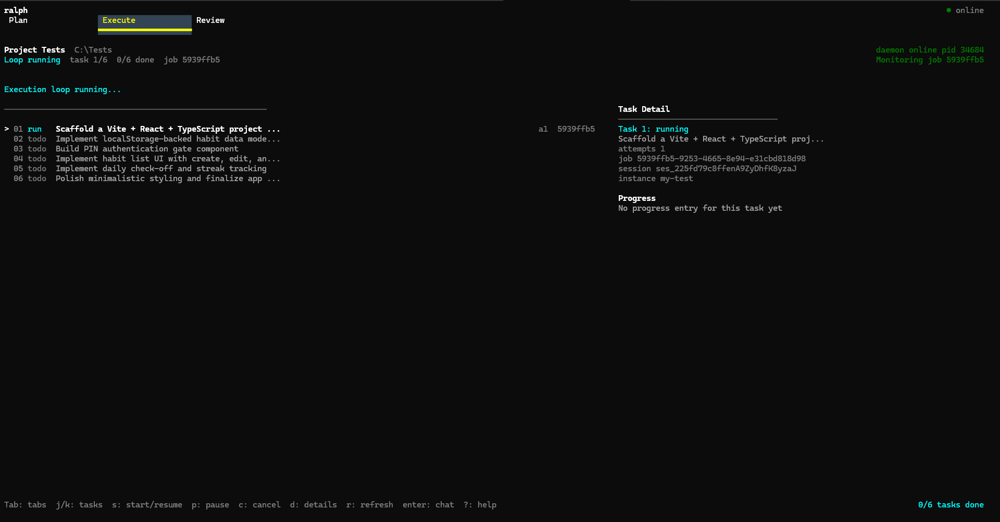
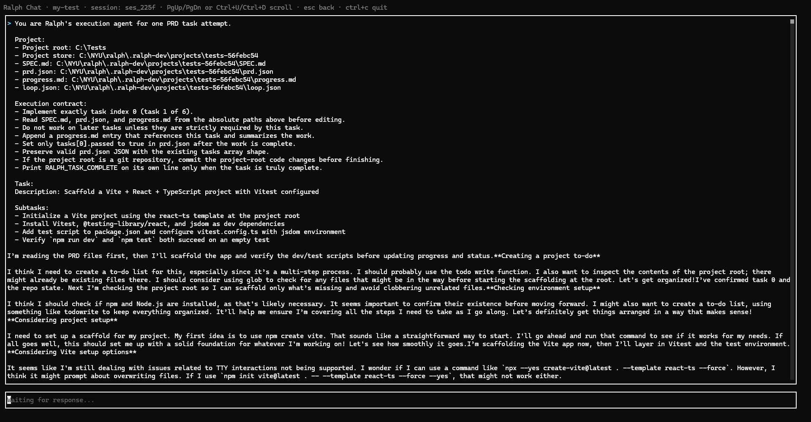
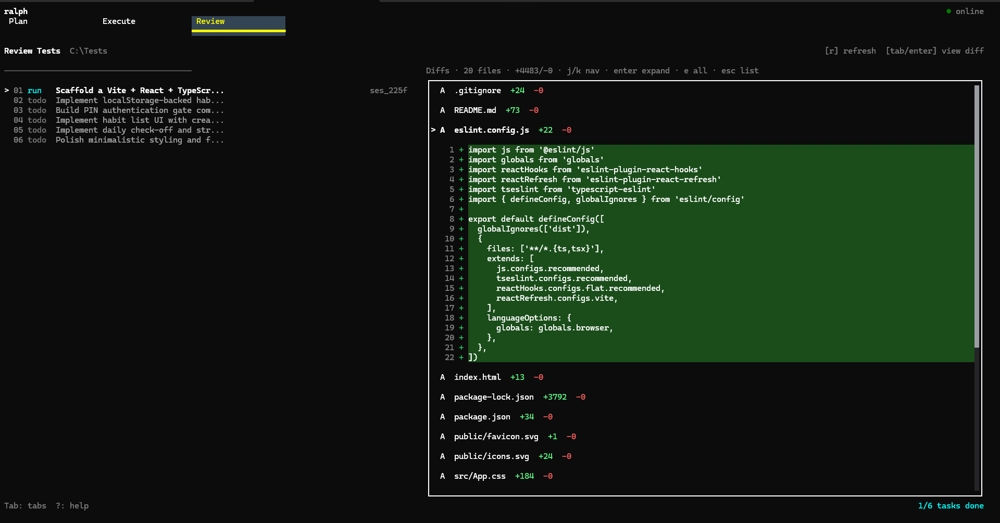

<!-- jump_to_middle -->

<!-- alignment: center -->

<!-- no_footer -->

# Live demo

- Spin up a **Ralph loop** with a pre-baked PRD
- Build a habit tracking web app

<!-- end_slide -->

# Ralph, the methodology

> [!important]
> **One task per session.** Read state from disk → execute → write state back → loop.

- <span style="color: palette:lavender">Files on disk are the contract</span>: `SPEC.md`, `prd.json`, `progress.md` are the agent's only memory between sessions
- <span style="color: palette:green">Each iteration starts fresh</span>: no carry-over context; the agent rebuilds state by reading the files

## **The loop, per iteration:**

1. **Read** `SPEC.md`, `prd.json`, `progress.md` to rebuild context
2. **Pick** one open task from `prd.json` (where `passed: false`)
3. **Implement & verify:** tests, type checks, lint
4. **Append** an entry to `progress.md`, mark the task `passed`, commit
5. **Signal** `RALPH_TASK_COMPLETE` → next iteration, fresh context

<!-- end_slide -->

# What is Ralph, the TUI

<!-- list_item_newlines: 1 -->

> [!tip]
> A **daemon-backed** TUI so agents keep working after you detach.

- <span style="color: palette:sky">Orchestration</span>: one loop across workspaces, not one-off chats
- <span style="color: palette:green">Resilience</span>: `ralphd` owns runs; the TUI is a thin client
- <span style="color: palette:yellow">Visibility</span>: single dashboard for every project in flight

<!-- end_slide -->

# Opencode problem → Ralph solution

<!-- column_layout: [1, 1] -->

<!-- column: 0 -->

> **Problem**

- In opencode, the **TUI and agent lifetime are tied together**
- Closing the UI can **kill long-running work**
- Multi-project workflows get **scattered across windows and sessions**

<!-- column: 1 -->

> **Solution**

- Ralph **decouples the TUI from the daemon**
- Agents keep running **in the background**
- One TUI gives a **single view across all active projects**

<!-- reset_layout -->

<!-- end_slide -->

# Methodology problem → Ralph solution

<!-- column_layout: [1, 1] -->

<!-- column: 0 -->

> **Problem**

- Giant sessions create **too much noise**
- Too much context can mean **worse performance and more hallucination**
- Goal-only prompting leaves agents **too much room to drift**

<!-- column: 1 -->

> **Solution**

- **One task per session:** isolated context, no bloat, fewer hallucinations
- **Pre-planned, actionable steps** in `prd.json`. Execution is instruction-following, not reasoning
- **Plan with a smart model, execute with a cheap one:** same quality, lower cost
- Workflow grounded in `PROMPT.md`, `SPEC.md`, `prd.json`, `progress.md`. **Explicit and reproducible.**

<!-- reset_layout -->

<!-- end_slide -->

# Product overview: Plan → Execute → Review

<!-- column_layout: [1, 1, 1] -->

<!-- column: 0 -->

### <span style="color: palette:sapphire">Plan</span>

- Shape **tasks** + acceptance in `prd.json`
- Ground truth in **`SPEC.md`**

<!-- column: 1 -->

### <span style="color: palette:green">Execute</span>

- **`ralphd`** drives the loop
- **Streaming logs** while work runs in the background

<!-- column: 2 -->

### <span style="color: palette:peach">Review</span>

- Inspect **output** before the next iteration
- **Roadmap:** richer diff / test surfacing in-review

<!-- reset_layout -->

<!-- end_slide -->

# Tech stack

| Layer    | Choice                                         |
| -------- | ---------------------------------------------- |
| Language | **TypeScript**                                 |
| UI       | **OpenTUI:** `@opentui/core`, `@opentui/react` |
| Runtime  | **Bun**                                        |
| Monorepo | **Turborepo** (dev orchestration)              |

<!-- end_slide -->

# The daemon

> [!note]
> **`ralphd`** is the source of truth for sessions, sockets, and persistence.

| Resource | Path / role                                        |
| -------- | -------------------------------------------------- |
| Socket   | `~/.ralph/ralphd.sock`                             |
| State DB | `~/.ralph/state.sqlite`                            |
| Role     | Spawn runs, stream output, survive without the TUI |

<!-- end_slide -->

# Inside `ralphd`: one runtime, many sessions

> **N workspaces · N agents · 1 shared runtime**

- Less memory, no port collisions
- Scales to as many agents as you want

```
  workspace A ─┐
                │
  workspace B ─┼─→  ralphd ─→  opencode
                │     (tags by directory)
  workspace N ─┘
```

<!-- end_slide -->

# Streaming service

- **Background execution:** detach the TUI without losing the agent
- **Live log fan-in:** stdout/stderr surfaces in the client
- **Multi-project fan-out:** same pipeline for every workspace

<!-- end_slide -->

# `.ralph/` workspace

> [!note]
> The **contract** between humans and agents lives on disk: inspectable, diffable, versioned.

| File          | Job                              |
| ------------- | -------------------------------- |
| `SPEC.md`     | What you are building            |
| `prd.json`    | Task list + pass / fail          |
| `progress.md` | Append-only iteration log        |
| `PROMPT.md`   | One-task-per-session agent rules |

```markdown +line_numbers
1. SPEC.md: what you're building
2. prd.json: task list
3. progress.md: append-only log
```

<!-- end_slide -->

# npm packaging

> [!tip]
> **`npm i -g @techatnyu/ralph`:** native binaries, no Node runtime, no postinstall scripts.

- **Pattern:** meta-package + per-platform packages via `optionalDependencies`
- **Bun compiles** `ralph` (TUI) and `ralphd` (daemon) into **single-file native binaries** that ships together per os/cpu
- **npm picks one package** from the user's `os` + `cpu`, so users only download bytes for their platform

```
  npm i -g @techatnyu/ralph
         │
         ▼
  ┌─ @techatnyu/ralph  (root meta-package) ─────────┐
  │    bin/ralph    ─ launcher (uname → exec)    │
  │    bin/ralphd   ─ launcher (uname → exec)    │
  │    optionalDependencies ↓                     │
  └───────────────┬───────────────────────────┘
                  │  npm resolves 1 of 6 by os + cpu
                  ▼
  ┌─ @techatnyu/ralph-{os}-{cpu} ─────────────┐
  │    bin/ralph    ─ compiled binary           │
  │    bin/ralphd   ─ compiled binary           │
  │    "os": [...]  "cpu": [...]                 │
  └───────────────────────────────────────────┘

  6 platforms: darwin / linux / windows  ×  x64 / arm64
```

<!-- end_slide -->

# npm packaging: build & publish

> Three scripts, one release. Driven by `scripts/release/`.

- **`bun release:build`:** `Bun.build({ compile })` → 6 targets × 2 binaries = **12 standalone executables**
- **`bun release:stage`:** lay out `dist/npm/{platform}/` + `dist/npm/root/`, generate `package.json`s and launchers
- **`bun release:publish`:** publish **platform packages first**, then root, so `optionalDependencies` always resolve

```ts +line_numbers
// scripts/release/shared.ts: single-file native compile
await Bun.build({
  entrypoints: [join(REPO_ROOT, "apps/tui/src/cli.ts")],
  compile: { target: "bun-darwin-arm64", outfile: "ralph" },
});
```

```json +line_numbers
// dist/npm/root/package.json  (generated by stage-npm.ts)
{
  "name": "@techatnyu/ralph",
  "bin": { "ralph": "bin/ralph", "ralphd": "bin/ralphd" },
  "optionalDependencies": {
    "@techatnyu/ralph-darwin-arm64": "0.0.1",
    "@techatnyu/ralph-linux-x64": "0.0.1"
    // … 4 more platforms
  }
}
```

<!-- end_slide -->

<!-- jump_to_middle -->

<!-- alignment: center -->

<!-- no_footer -->

<span style="color: palette:mauve">Showcase</span>

# Showcase: Plan view

- Trace **PRD → task pick → spec context** in the TUI
- Call out how **`prd.json`** steers the next session

<!-- end_slide -->

<!-- jump_to_middle -->

<!-- alignment: center -->

<!-- no_footer -->

<span style="color: palette:mauve">Showcase</span>

# Showcase: Multiple projects at once

- Flip between workspaces **without losing narrative**
- Compare **agent state** side-by-side in one surface

<!-- end_slide -->

# Showcase

<!-- list_item_newlines: 1 -->

> **Execution view**

- **Streaming output:** stdout/stderr surfaces live in the TUI
- **Background-friendly:** detach the TUI without killing the run
- **Multi-project fan-out:** every active workspace, one stream



<!-- end_slide -->

# Showcase

<!-- list_item_newlines: 1 -->

> **Execution view**

- **Streaming output:** stdout/stderr surfaces live in the TUI
- **Background-friendly:** detach the TUI without killing the run
- **Multi-project fan-out:** every active workspace, one stream



<!-- end_slide -->

# Showcase

<!-- list_item_newlines: 1 -->

> **Review view**

- **Per-session diffs:** every file the agent touched
- **Inspect before iterating:** catch drift between runs
- **Roadmap:** richer tests + approvals inline



<!-- end_slide -->

# What's next

- **Review surface:** richer diffs, tests, approvals inline
- **Prompt injection mid-run:** steer without restarting the loop
- **Opencode parity:** manual skill activation and custom commands
- **Better interface:** need more polished UI/UX

<!-- end_slide -->

<!-- column_layout: [1, 3, 1] -->

<!-- column: 1 -->

<!-- jump_to_middle -->

<!-- alignment: center -->

<!-- no_footer -->

# Thanks / Q&A

- Repo: **`TechAtNYU/ralph`**

<!-- reset_layout -->

<!-- end_slide -->
